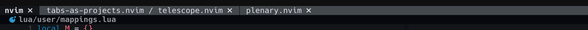

# tabs-as-projects.nvim


A Neovim plugin that helps treat tabs as projects by providing a
telescope-based project picker and a custom tabline that displays working
directories.

> **Note**: This plugin was extracted from my personal Neovim config, so it's
> opinionated by design.

Table of Contents:

- [Features](#features)
- [Installation](#installation)
- [Configuration](#configuration)
  - [Example setup](#example-setup)
  - [Configuration options](#configuration-options)
  - [Custom list_dir implementation](#custom-list_dir-implementation)
  - [Customizing colors](#customizing-colors)

## Features



- **Project Picker**: Telescope-based fuzzy finder for quickly opening projects
  - Search across multiple configured directories
  - Categorize projects for better organization
  - Customizable path display (show last N parts of the path)
  - Smart tab creation (creates new tab only if current tab has content)
  - Configurable directory listing function

- **Custom Tabline**: Visual representation of tabs as projects
  - Displays working directory name(s) for each tab
  - Supports multiple working directories per tab (window-local cwd)
  - Highlights current directory in bold
  - Custom color scheme that adapts to your colorscheme
  - Clean visual separators between tabs

## Installation

Requirements:
- Neovim >= 0.9.0
- [telescope.nvim](https://github.com/nvim-telescope/telescope.nvim)
- `find` command (typically pre-installed on Unix-like systems)


<details>
<summary>Using lazy.nvim</summary>

```lua
{
  "brotifypacha/tabs-as-projects.nvim",
  dependencies = {
    "nvim-telescope/telescope.nvim",
  },
  config = function()

    local tabs_as_projects = require("tabs-as-projects")

    -- Enable tabline (use `:help 'showtabline'` for more details)
    vim.opt.showtabline = 2
    -- Use plugin-provided tabline
    vim.opt.tabline = "%!v:lua.require('tabs-as-projects.ui').tabline()"

    -- Optionally override some ui settings
    tabs_as_projects.setup({
      ui = {
        use_nerd_font = true
      }
    })

    -- Create a keymap for the project picker
    vim.keymap.set("n", "<F1>", tabs_as_projects.pick_project({
      search_dirs = {
        { path = "~/workspace", category = "work" },
        { path = "~/personal", category = "other" },
        { path = "~/.config", category = "config" },
      },
    }))

  end,
}
```

</details>

<details>
<summary>Using packer.nvim</summary>

```lua
use {
  "brotifypacha/tabs-as-projects.nvim",
  requires = {
    "nvim-telescope/telescope.nvim",
  },
  config = function()
    local tabs_as_projects = require("tabs-as-projects")

    -- Enable tabline (use `:help 'showtabline'` for more details)
    vim.opt.showtabline = 2
    -- Use plugin-provided tabline
    vim.opt.tabline = "%!v:lua.require('tabs-as-projects.ui').tabline()"

    -- Optionally override some ui settings
    tabs_as_projects.setup({
      ui = {
        use_nerd_font = true
      }
    })

    -- Create a keymap for the project picker
    vim.keymap.set("n", "<F1>", tabs_as_projects.pick_project({
      search_dirs = {
        { path = "~/workspace", category = "work" },
        { path = "~/personal", category = "other" },
        { path = "~/.config", category = "config" },
      },
    }))

  end,
}
```

</details>

<details>
<summary>Using vim.pack (Neovim v0.12+)</summary>

```lua

vim.pack.add({
  "https://github.com/BrotifyPacha/tabs-as-projects.nvim.git"
})

local tabs_as_projects = require("tabs-as-projects")

-- Enable tabline (use `:help 'showtabline'` for more details)
vim.opt.showtabline = 2
-- Use plugin-provided tabline
vim.opt.tabline = "%!v:lua.require('tabs-as-projects.ui').tabline()"

-- Optionally override some ui settings
tabs_as_projects.setup({
  ui = {
    use_nerd_font = true
  }
})

-- Create a keymap for the project picker
vim.keymap.set("n", "<F1>", tabs_as_projects.pick_project({
  search_dirs = {
    { path = "~/workspace", category = "work" },
    { path = "~/personal", category = "other" },
    { path = "~/.config", category = "config" },
  },
}))

```

</details>

## Configuration

### Example Setup

```lua

local tabs_as_projects = require("tabs-as-projects")

vim.opt.showtabline = 2
vim.opt.tabline = "%!v:lua.require('tabs-as-projects.ui').tabline()"

tabs_as_projects.setup({
  ui = {
    use_nerd_font = true
  }
})

vim.keymap.set("n", "<F1>", tabs_as_projects.pick_project({
  search_dirs = {
    { path = "~/workspace", category = "work" },
    { path = "~/personal", category = "other" },
    { path = "~/.config", category = "config" },
  },
}))

```

### Configuration Options

```lua
local tabs_as_projects = require("tabs-as-projects")

-- Setup options
tabs_as_projects.setup({
  -- optional - ui config
  ui = {
    -- optional, bool (default: false) - override tabline close_icon button to
    -- use nerd font icon
    use_nerd_font = true,

    -- optional, string|nil - configures close_icon directly, you can set it
    -- to "" to disable it completely
    close_icon = '<your icon>'
  }
})


-- Pick project options
tabs_as_projects.pick_project({

  -- (list of directory configs, required)
  search_dirs = {
    {
      -- (string, required) - Path to search project directories in
      path = "~/workspace",

      -- (string, optional) A label to categorize projects (if present, displayed in picker)
      category = "work",

      -- (integer, optional, default: 2): Number of path parts to show in picker
      -- for example given an absolute project path /User/example/workspace/project-a
      -- value 1 will display such path as: project-a
      -- value 2 will display such path as: workspace/project-a
      -- value 3 will display such path as: example/workspace/project-a
      -- and so on
      display_path_parts = 2,
    },
  },

  -- (fun(path: string) string[], optional) - Function to list directories with
  list_dir = require("tabs-as-projects.list_dir_fn").find_list_dir
})

```

### Custom `list_dir` implementation

If for some reason, default `find_list_dir` doesn't suit your needs, you can
create your own using a helper function `list_using_cmd`:

```lua
local list_dir_fn = require("tabs-as-projects.list_dir_fn")

pick_project({
  search_dirs = { --[[ ... ]] },
  -- The '%s' will be substituted by 'path' argument of your configured 'search_dirs'.
  list_dir = list_dir_fn.list_using_cmd('fd --type d --max-depth 1 . "%s"'),
})
```

Or create your create your own from scratch:

```lua
--- @param path string
--- @return string[]
local function my_custom_list_dir(path)
  -- Your custom logic here
  -- Return an array of absolute directory paths
  return {
    path .. "/project1",
    path .. "/project2",
  }
end

pick_project({
  search_dirs = { --[[ ... ]] },
  list_dir = my_custom_list_dir,
})
```

### Custom mappings inside telescope picker

If you want to customize mappings inside the telescope picker,
you can do so by providing your own 'attach_mappings' func.

Here's an example config for that:

```lua

vim.keymap.set("n", "<F1>", tabs_as_projects.pick_project({
  search_dirs = {
    { path = "~/workspace", category = "work" },
  },
  mappings = function(_, map)

    local telescope_actions = require("telescope.actions")
    local tabs_as_projects_actions = require("tabs-as-projects.picker")

    map("n", "<TAB>", telescope_actions.toggle_selection)
    map("i", "<TAB>", telescope_actions.toggle_selection)
    map("n", "<CR>",  tabs_as_projects_actions.select_tab_project)
    map("i", "<CR>",  tabs_as_projects_actions.select_tab_project)
    map("n", "<C-l>", tabs_as_projects_actions.select_local_project)
    map("i", "<C-l>", tabs_as_projects_actions.select_local_project)

    -- Return:
    -- true - to enable default telescope mappings
    -- false - to leave only the mappings you defined above
    return true

  end
}))
```

### Customizing Colors

The tabline uses highlight groups that you can customize:

- `TabProjects_Tab` - Inactive tab (links to `Tabline` by default)
- `TabProjects_TabSelected` - Active tab (links to `Normal` by default)
- `TabProjects_TabSelectedBold` - Current directory in active tab (bold)
- `TabProjects_Divider` - Separator between tabs
- `TabProjects_DividerSelected` - Separator adjacent to active tab

Example customization:

```lua
-- vim.o.tabline = ...

-- Should be used after tabline setup
vim.api.nvim_set_hl(0, "TabProjects_TabSelected", { bg = "#1e1e2e", fg = "#cdd6f4" })
vim.api.nvim_set_hl(0, "TabProjects_TabSelectedBold", { bg = "#1e1e2e", fg = "#cdd6f4", bold = true })
```

## Health Check

Run `:checkhealth tabs-as-projects` to verify:
- Telescope is installed
- Required binaries (`find`) are available

## License

MIT
